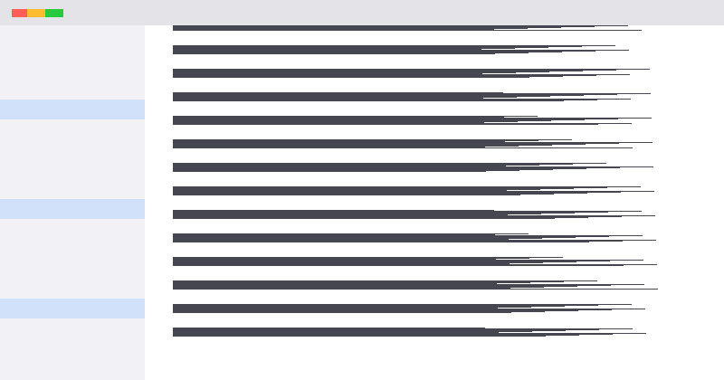

# Installation

MD Reader is a small native app. Download the installer for your platform, or build it from source.

## macOS

1. Download `MD-Reader.dmg`.
2. Drag **MD Reader** to *Applications*.
3. Right-click a `.md` file → **Open With** → MD Reader.

> [!NOTE]
> On first launch macOS may ask you to confirm opening an app downloaded from the internet.

## Windows

Run `MD-Reader-setup.exe`. The installer registers the `.md` file type.

## From source

```sh
git clone https://example.com/md-reader.git
cd md-reader
npm install
npm run tauri dev
```



Next: [First steps](02-first-steps.md).
