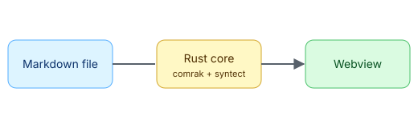

# First steps

## Opening a file

Double-click any markdown file, or use **File → Open File…** (<kbd>⌘</kbd><kbd>O</kbd>).

## Opening a folder

Use **File → Open Folder…** (<kbd>⌘</kbd><kbd>⇧</kbd><kbd>O</kbd>). The sidebar lists every markdown
file below the folder. Type in the filter box to narrow it down.

## Navigating

| Action          | macOS                        | Windows                        |
| --------------- | ---------------------------- | ------------------------------ |
| Back / forward  | <kbd>⌘</kbd><kbd>[</kbd> / <kbd>⌘</kbd><kbd>]</kbd> | <kbd>Ctrl</kbd><kbd>[</kbd> / <kbd>Ctrl</kbd><kbd>]</kbd> |
| Go to file      | <kbd>⌘</kbd><kbd>P</kbd>     | <kbd>Ctrl</kbd><kbd>P</kbd>    |
| Find            | <kbd>⌘</kbd><kbd>F</kbd>     | <kbd>Ctrl</kbd><kbd>F</kbd>    |
| Toggle sidebar  | <kbd>⌘</kbd><kbd>\</kbd>     | <kbd>Ctrl</kbd><kbd>\</kbd>    |

See also the [installation guide](./01-installation.md#from-source) and the
[FAQ](../03-reference/faq.md#why-is-it-so-fast).
