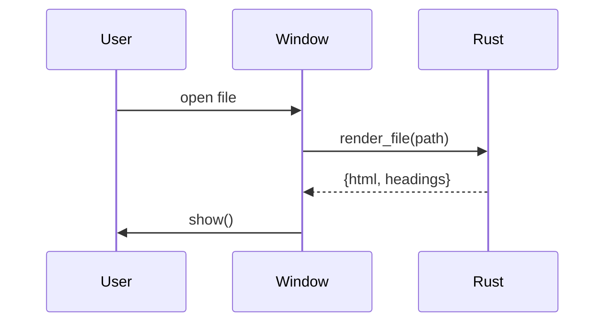

# Math & diagrams

These are rendered by plugins (KaTeX and Mermaid), loaded lazily only when a document needs them.

## Math

The quadratic formula is $x = \frac{-b \pm \sqrt{b^2 - 4ac}}{2a}$, and Euler's identity reads $e^{i\pi} + 1 = 0$.

$$
\sum_{n=1}^{\infty} \frac{1}{n^2} = \frac{\pi^2}{6}
$$

```math
\begin{aligned}
\nabla \cdot \mathbf{E} &= \frac{\rho}{\varepsilon_0} \\
\nabla \times \mathbf{B} &= \mu_0 \mathbf{J} + \mu_0 \varepsilon_0 \frac{\partial \mathbf{E}}{\partial t}
\end{aligned}
```

## Mermaid




Back to the [feature tour](../01-markdown-features.md#math).
